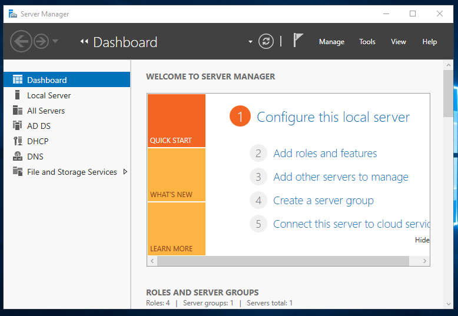
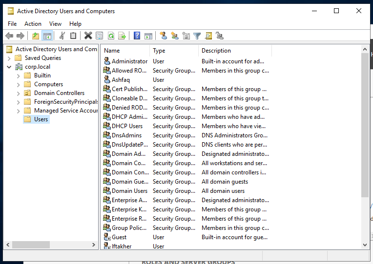
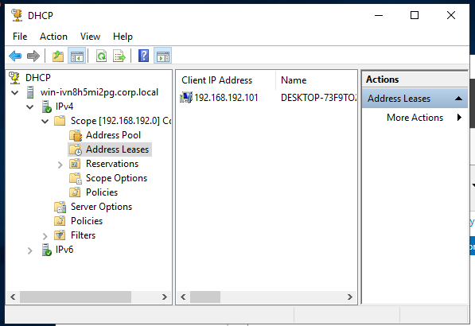
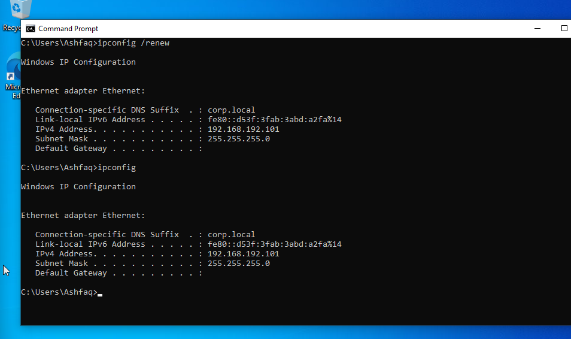
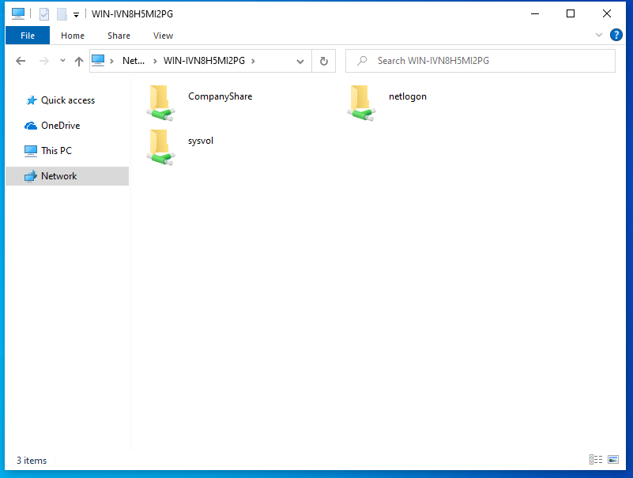

# Corporate Private Network Lab

## Overview

This project simulates a small company network using Windows Server and Windows client machines. The goal was to build a private internal network with centralized user authentication, automatic IP addressing, DNS, and shared resources.

## Project Goals

- Configure a Windows Server as a domain controller
- Set up Active Directory users
- Configure DHCP for automatic IP assignment
- Configure DNS for domain name resolution
- Join Windows client machines to the domain
- Test domain user login
- Configure shared folder access for authenticated users

## Technologies Used

- Windows Server
- Active Directory Domain Services
- DNS
- DHCP
- Windows 10 Client
- VirtualBox
- Private Network / Host-only Network

## Lab Design

The lab contains one Windows Server and two Windows client machines connected to the same private network.

| Device | Role | Purpose |
|---|---|---|
| Windows Server | Domain Controller | AD, DNS, DHCP |
| Client 1 | Windows Client | Domain login testing |
| Client 2 | Windows Client | Domain login and file sharing test |

## Features Implemented

- Centralized domain login
- Domain users created in Active Directory
- DHCP automatic IP assignment
- DNS configured for the internal domain
- Client machines joined to the domain
- Shared folder access for domain users

## Screenshots

### 1. Server Manager Roles

This screenshot shows the Windows Server roles used in the lab, including Active Directory Domain Services, DHCP, DNS, and File and Storage Services.

### 2. Active Directory Users

This screenshot shows the `corp.local` domain and the domain users created for testing centralized authentication.

### 3. DHCP Address Leases

This screenshot shows that the Windows client received an IP address automatically from the DHCP server.

### 4. Client IP Configuration

This screenshot shows the client network configuration, including the `corp.local` DNS suffix and the assigned IPv4 address.

### 5. Domain User Login Proof

This screenshot shows the client logged in as the domain user `corp\ashfaq`.

### 6. Shared Folder Access

This screenshot shows the client accessing shared folders from the Windows Server, including `CompanyShare`, `netlogon`, and `sysvol`.

## What I Learned

- How to set up a basic company-style private network
- How Active Directory centralizes user authentication
- How DHCP assigns IP addresses automatically
- How DNS supports domain communication
- How to join client computers to a Windows domain
- How to troubleshoot domain login and shared folder access

## Future Improvements

- Add Group Policy settings
- Add more client computers
- Add password policy
- Add network drive mapping
- Add backup configuration
